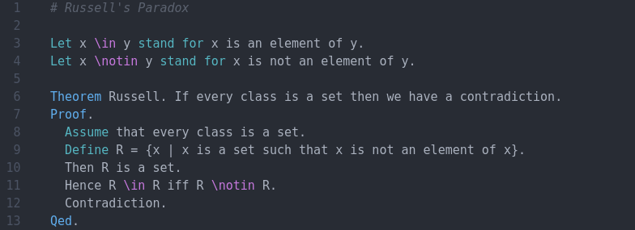
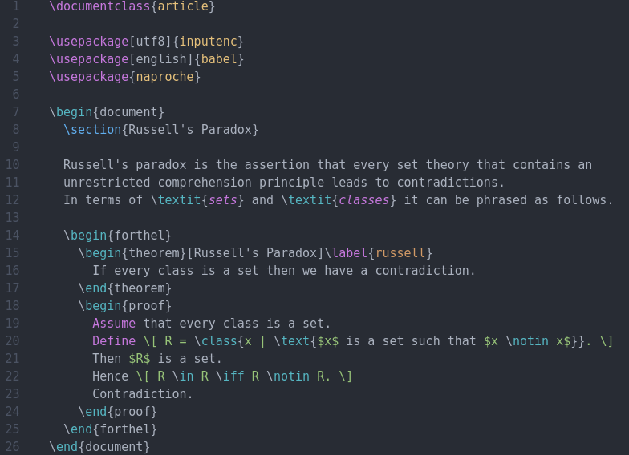

# Syntax highlighting for ForTheL and LaTeX

This package provides syntax highlighting for `ftl` and `tex` files (and several
other LaTeX-related file types, including `ftl.tex`) in [Atom][1].

It is largely based on [language-latex2e][2].

## Screenshots

### ForTheL:

### LaTeX:

[1]: <https://atom.io/>
[2]: <https://atom.io/packages/language-latex2e>
