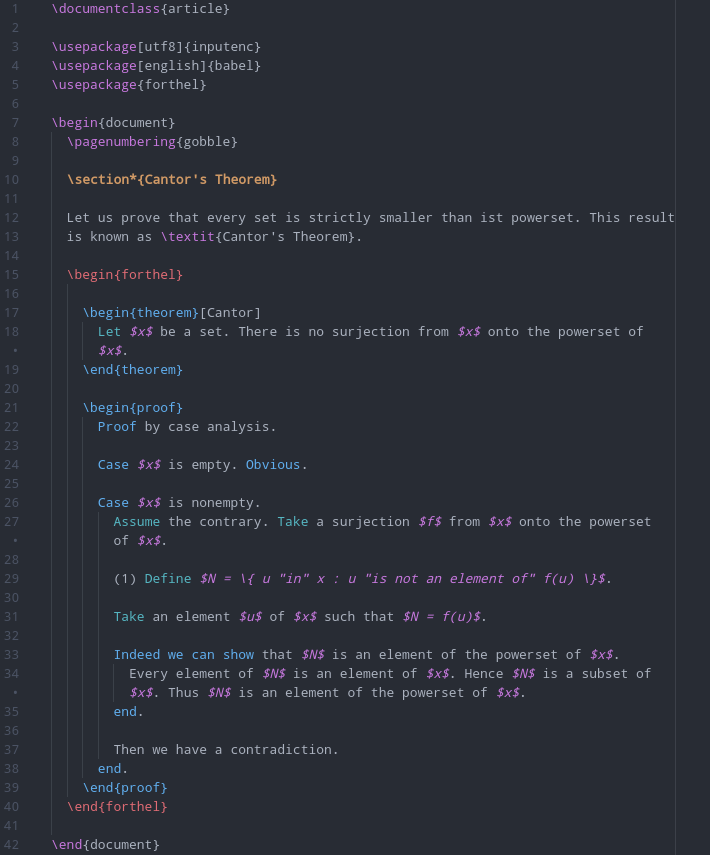

# ForTheL language support in Atom

Adds syntax highlighting to ForTheL in Atom

ForTheL is a natural formal language for writing mathematical texts which can be
checked with the proof assistant ℕaproche. Since 2021 ℕaproche supports
embedding ForTheL into LaTeX.

## Usage

This package supports both ForTheL's standard version and its LaTeX version.

* Syntax highlighting for ForTheL's standard version works out of the box.

* To use syntax highlighting for ForTheL's LaTeX version, you must additionally
  install the package [language-latex2e](https://atom.io/packages/language-latex2e).
  Moreover, you may need to disable all other syntax highlighting packages for
  LaTeX.

## Screenshots

### Standard version:

### LaTeX version:

## Links

* ℕaproche's GitHub repository:  
  <https://github.com/naproche-community/naproche>

* FLib, a collection of ForTheL texts:  
  <https://github.com/naproche-community/FLib>

* Slides of ℕaproche-related talks:  
  <https://github.com/naproche-community/Talks>

* Isabelle2021-RC6, which comes with an integration of ℕaproche:  
  <https://isabelle.sketis.net/website-Isabelle2021-RC6>
