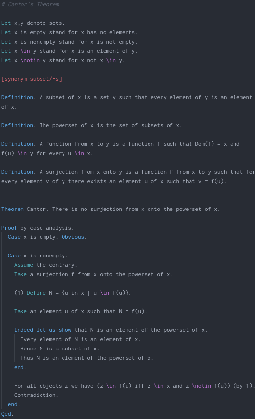

# ForTheL language support in Atom

Adds syntax highlighting to ForTheL in Atom

ForTheL is a natural formal language for writing mathematical texts which can be
checked with the proof assistant
[Naproche-SAD](https://files.sketis.net/Isabelle_Naproche-20190611/).

For more information about ForTheL have a look at the GitHub page of the
[Naproche Community](https://github.com/naproche-community). There you will find
some example texts that are written in ForTheL and also a lot of documents that
describe ForTheL and Naproche-SAD.

